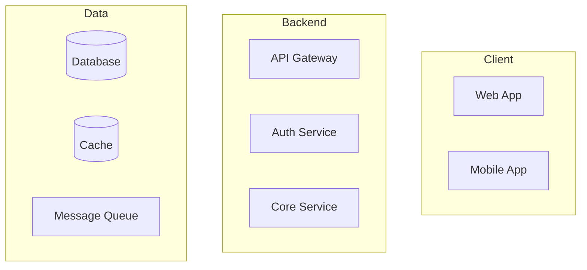

# Technical Architecture Design

## Purpose

Use this Skill to create comprehensive technical architecture for MVPs and applications:
- System architecture and component design
- Technology stack selection with justifications
- Integration patterns and data flows
- Infrastructure and deployment strategy

## Inputs

The main agent should provide:
- Product requirements (PRD or feature specs)
- Target scale and performance requirements
- Team expertise and constraints
- Budget and timeline considerations
- Existing systems to integrate with (if any)

If missing, ask clarifying questions or document assumptions.

## Process

### 1. Architecture Overview

Create a high-level system diagram showing:
- Major components and their responsibilities
- Communication patterns (sync/async, REST/GraphQL/events)
- External services and integrations
- Data stores and caching layers

Use Mermaid for diagrams:

### 2. Technology Stack Selection

For each layer, recommend technologies with rationale:

**Frontend:**
- Framework (Next.js, React, Vue, etc.)
- State management approach
- Styling solution
- Build tooling

**Backend:**
- Framework (Nest.js, Express, Fastify, etc.)
- API style (REST, GraphQL, gRPC)
- ORM/Query builder
- Background jobs

**Data Layer:**
- Primary database (PostgreSQL, MySQL, MongoDB, etc.)
- Caching strategy (Redis, in-memory)
- Search (if needed)
- File storage

**Infrastructure:**
- Hosting platform (Vercel, AWS, GCP, etc.)
- Container orchestration (if needed)
- CDN strategy
- Monitoring stack

### 3. Architecture Patterns

Document key architectural patterns:
- **Authentication flow** (JWT, sessions, OAuth)
- **Authorization model** (RBAC, ABAC, policies)
- **Data access patterns** (Repository, Active Record)
- **Error handling strategy**
- **Logging and observability**

### 4. Data Architecture

Design the data layer:
- **Entity Relationship Diagram** (ERD in Mermaid)
- **Data flow diagrams** for key operations
- **Caching strategy** (what, where, TTL)
- **Data partitioning** (if scale requires)

### 5. API Design Principles

Establish API conventions:
- Naming conventions
- Versioning strategy
- Pagination approach
- Error response format
- Rate limiting strategy

### 6. Security Architecture

Address security concerns:
- Authentication mechanisms
- Authorization boundaries
- Data encryption (at rest, in transit)
- Input validation strategy
- OWASP top 10 mitigations

### 7. Scalability Considerations

Plan for growth:
- Horizontal vs vertical scaling approach
- Stateless service design
- Database scaling strategy
- Caching for hot paths
- Async processing for heavy operations

### 8. Technical Risks & Mitigations

Identify and address:
- Technology risks
- Integration complexities
- Performance bottlenecks
- Security vulnerabilities
- Vendor dependencies

## Output Format

Produce a structured architecture document with:
- Executive summary
- Architecture diagrams (Mermaid)
- Technology stack table
- Component descriptions
- Data architecture
- Security considerations
- Scalability plan
- Risk register
- Open questions for team discussion

## Best Practices

- **Keep it simple**: Start with the simplest architecture that meets requirements
- **Document decisions**: Record why choices were made, not just what
- **Plan for change**: Design for extensibility
- **Security by design**: Build security in, don't bolt it on
- **Consider operations**: Think about deployment, monitoring, debugging
