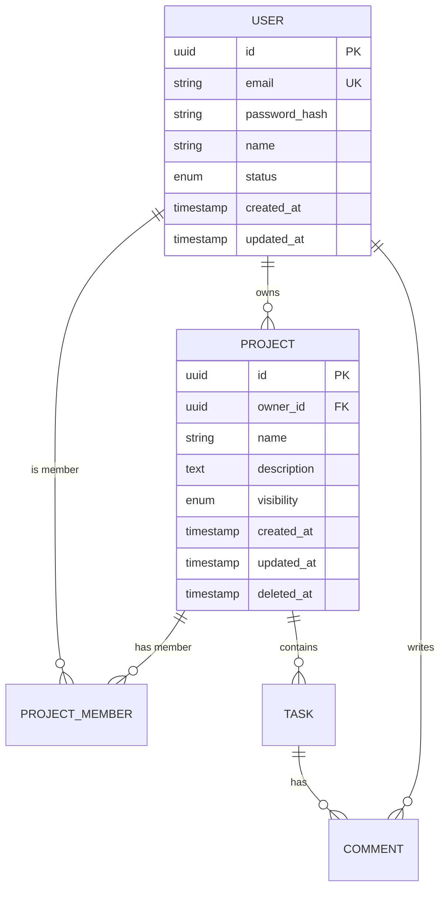

# Database Design

## Purpose

Use this Skill to design robust database schemas:
- Entity-Relationship modeling
- Schema design with proper normalization
- Index strategy for performance
- Migration and seeding plans

## Inputs

The main agent should provide:
- Business entities and their attributes
- Relationships between entities
- Expected data volumes and access patterns
- Performance requirements

## Process

### 1. Entity Identification

From requirements, identify:
- Core entities (Users, Projects, Tasks, etc.)
- Supporting entities (Settings, Notifications, etc.)
- Junction tables for many-to-many relationships
- Audit/history tables if needed

### 2. Entity-Relationship Diagram

Create ERD using Mermaid:



### 3. Table Definitions

For each entity, define:

```sql
CREATE TABLE users (
    id UUID PRIMARY KEY DEFAULT gen_random_uuid(),
    email VARCHAR(255) NOT NULL UNIQUE,
    password_hash VARCHAR(255) NOT NULL,
    name VARCHAR(100) NOT NULL,
    avatar_url VARCHAR(500),
    status VARCHAR(20) DEFAULT 'active' CHECK (status IN ('active', 'inactive', 'suspended')),
    email_verified_at TIMESTAMP,
    last_login_at TIMESTAMP,
    created_at TIMESTAMP NOT NULL DEFAULT NOW(),
    updated_at TIMESTAMP NOT NULL DEFAULT NOW()
);

-- Indexes
CREATE INDEX idx_users_email ON users(email);
CREATE INDEX idx_users_status ON users(status);
```

### 4. Relationship Patterns

Document relationship implementations:

**One-to-Many:**
```sql
-- Project belongs to User (owner)
ALTER TABLE projects 
ADD COLUMN owner_id UUID REFERENCES users(id) ON DELETE RESTRICT;
```

**Many-to-Many:**
```sql
-- Users can be members of multiple projects
CREATE TABLE project_members (
    project_id UUID REFERENCES projects(id) ON DELETE CASCADE,
    user_id UUID REFERENCES users(id) ON DELETE CASCADE,
    role VARCHAR(20) DEFAULT 'member',
    joined_at TIMESTAMP DEFAULT NOW(),
    PRIMARY KEY (project_id, user_id)
);
```

**Self-referential:**
```sql
-- Tasks can have subtasks
ALTER TABLE tasks 
ADD COLUMN parent_task_id UUID REFERENCES tasks(id) ON DELETE CASCADE;
```

### 5. Index Strategy

Design indexes for common queries:

| Table | Index | Columns | Type | Reason |
|-------|-------|---------|------|--------|
| users | idx_users_email | email | UNIQUE | Login lookup |
| tasks | idx_tasks_project_status | project_id, status | BTREE | Project task filtering |
| tasks | idx_tasks_assignee | assignee_id | BTREE | User's tasks |
| tasks | idx_tasks_due_date | due_date | BTREE | Deadline queries |

### 6. Soft Delete Strategy

Implement soft deletes where appropriate:

```sql
-- Add deleted_at column
ALTER TABLE projects ADD COLUMN deleted_at TIMESTAMP;

-- Partial index for active records
CREATE INDEX idx_projects_active ON projects(id) WHERE deleted_at IS NULL;

-- View for active records
CREATE VIEW active_projects AS
SELECT * FROM projects WHERE deleted_at IS NULL;
```

### 7. Audit Trail

If audit is required:

```sql
CREATE TABLE audit_logs (
    id UUID PRIMARY KEY DEFAULT gen_random_uuid(),
    table_name VARCHAR(50) NOT NULL,
    record_id UUID NOT NULL,
    action VARCHAR(20) NOT NULL,  -- INSERT, UPDATE, DELETE
    old_values JSONB,
    new_values JSONB,
    user_id UUID REFERENCES users(id),
    ip_address INET,
    created_at TIMESTAMP DEFAULT NOW()
);

CREATE INDEX idx_audit_logs_table_record ON audit_logs(table_name, record_id);
CREATE INDEX idx_audit_logs_user ON audit_logs(user_id);
```

### 8. Data Types Best Practices

Choose appropriate types:

| Use Case | Type | Notes |
|----------|------|-------|
| Primary keys | UUID | Avoid sequential IDs for security |
| Money | DECIMAL(19,4) | Never use FLOAT |
| Timestamps | TIMESTAMP WITH TIME ZONE | Always store UTC |
| Status/Enum | VARCHAR with CHECK | Or native ENUM |
| JSON data | JSONB | For flexible schemas |
| Large text | TEXT | No practical limit |

### 9. Migration Strategy

Plan migrations:

```typescript
// Migration file structure
migrations/
├── 001_create_users.ts
├── 002_create_projects.ts
├── 003_create_tasks.ts
├── 004_add_project_members.ts
└── 005_add_audit_logs.ts

// Each migration should be:
// - Idempotent (safe to run multiple times)
// - Reversible (down migration)
// - Atomic (transaction-wrapped)
```

### 10. Seeding Plan

Plan seed data for development:

```typescript
// Seed categories
seeds/
├── 01_roles.ts          // System roles
├── 02_admin_user.ts     // Default admin
├── 03_demo_data.ts      // Demo project/tasks
└── 04_test_users.ts     // Test accounts (dev only)
```

## Output Format

Produce documentation with:
- ERD diagram (Mermaid)
- Table definitions (SQL or ORM schema)
- Index strategy table
- Relationship documentation
- Migration plan
- Seed data plan
- Performance considerations

## Best Practices

- **Normalize first**, denormalize when proven necessary
- **Use UUIDs** for primary keys in public APIs
- **Always add timestamps** (created_at, updated_at)
- **Plan for soft deletes** from the start
- **Index foreign keys** by default
- **Document constraints** and their business reasons
